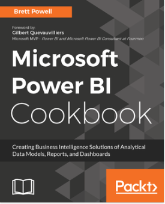
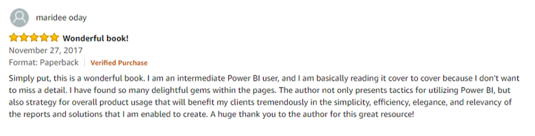
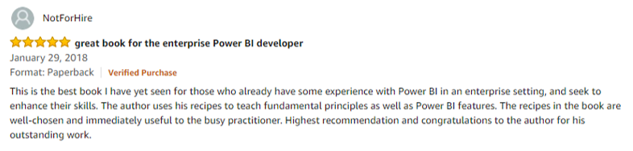
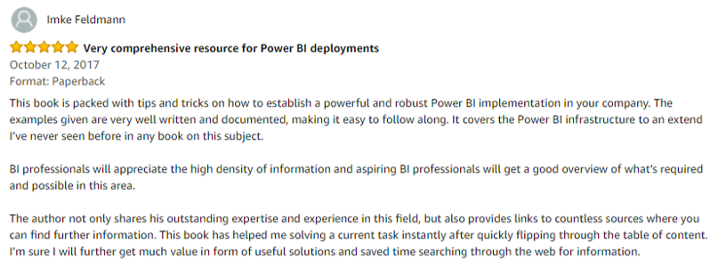

# Microsoft Power BI Cookbook
[Microsoft Power BI Cookbook](https://www.packtpub.com/big-data-and-business-intelligence/microsoft-power-bi-cookbook?utm_source=github&utm_medium=repository&utm_campaign=9781788290142), published by [Packt](https://www.packtpub.com/) 

### Get more out of Microsoft Power BI turning your data into actionable insights

## What is this book about?

Microsoft Power BI is a business intelligence and analytics platform consisting of applications and services designed to provide coherent, visual, and interactive insights of data.
 

This book will provide thorough, technical examples of using all primary Power BI tools and features as well as demonstrate high impact end-to-end solutions that leverage and integrate these technologies and services. Get familiar with Power BI development tools and services, go deep into the data connectivity and transformation, modeling, visualization, and analytical capabilities of Power BI, and see Power BI's functional programming languages of DAX and M come alive to deliver powerful solutions to address common, challenging scenarios in business intelligence.
 

This book will excite and empower you to get more out of Power BI via detailed recipes, advanced design and development tips, and guidance on enhancing existing Power BI projects.
 

## Key Features of Microsoft Power BI Cookbook

<ul><li>From connecting to your data sources to developing and deploying immersive, mobile-ready dashboards and visualizations, this book covers it all</li> 
<li>Over 90 hands-on, technical recipes, tips, and use cases from across the Power BI platform including the Power BI Service and Mobile Applications</li> 
<li>Proven development techniques and guidance for implementing custom solutions with DAX and M languages</li> 
</ul>

## Who is this book for?

This book is for BI professionals who wish to enhance their knowledge of Power BI beyond and to enhance the value of the Power BI solutions they deliver to business users. Those who are looking at quick solutions to common problems while using Power BI will also find this book to be a very useful resource.Some experience with Power BI will be useful. If you feel this book is for you, get your <a href="https://www.amazon.com/Microsoft-Power-Cookbook-Intelligence-Analytical/dp/1788290143">copy</a> today!
 

## What will you learn from this book? 
<ul><li>Cleanse, stage, and integrate your data sources with Power BI</li> 
<li>Abstract data complexities and provide users with intuitive, self-service BI capabilities</li> 
<li>Build business logic and analysis into your solutions via the DAX programming language and dynamic, dashboard-ready calculations</li> 
<li>Take advantage of the analytics and predictive capabilities of Power BI</li> 
<li>Make your solutions more dynamic and user specific and/or defined including use cases of parameters, functions, and row level security</li> 
<li>Understand the differences and implications of DirectQuery, Live Connections, and Import-Mode Power BI datasets and how to deploy content to the Power BI Service and schedule refreshes</li> 
<li>Integrate other Microsoft data tools such as Excel and SQL Server Reporting Services into your Power BI solution</li> 
</ul>

## Brett Powell's Interview
<ul><li>You can check out Brett Powell's exclusive two-part interview (<a href="https://datahub.packtpub.com/interview/microsoft-power-bi-interview-part1-brett-powell/">Part 1</a> and <a href="https://datahub.packtpub.com/interview/unlocking-the-secrets-of-microsoft-power-bi-interview-part-2-of-2-with-brett-powell-founder-of-frontline-analytics-llc/">Part 2</a>) with Packt on the DataHub website, where Brett shares his insights in the area of Power BI. </li> 
</ul>

## Amazon Reviews

 

 

 

## Where can you buy this book?
* Amazon - [Microsoft Power BI Cookbook](https://www.amazon.com/Microsoft-Power-Cookbook-Intelligence-Analytical/dp/1788290143/ref=sr_1_1?ie=UTF8&qid=1519127013&sr=8-1&keywords=Microsoft+Power+BI+Cookbook) 
* Packt- [Microsoft Power BI Cookbook](https://www.packtpub.com/big-data-and-business-intelligence/microsoft-power-bi-cookbook?utm_source=github&utm_medium=authorengagement&utm_campaign=9781788290142)

## Get to Know the Author

<i >Brett Powell</i>
 

 

<i >Brett Powell is the owner of and business intelligence consultant at Frontline Analytics LLC, a data and analytics research and consulting firm and Microsoft Power BI partner. He has worked with Power BI technologies since they were first introduced as the SQL Server 2008R2 PowerPivot add-in for Excel 2010. He has contributed to the design and development of Microsoft and Power BI solutions of diverse scale and complexity across the retail, manufacturing, financial, and services industries. Brett regularly blogs and shares technical papers regarding the latest MSBI and Power BI features and development techniques and patterns at Insight Quest. He is also an organizer of the Boston BI User Group.</i>
 

<b ><i >Amazon -</i></b><a href="https://www.amazon.com/Brett-Powell/e/B0776QWS1N/ref=ntt_dp_epwbk_0"><i >https://www.amazon.com/Brett-Powell/e/B0776QWS1N/ref=ntt_dp_epwbk_0</i></a>
 

<b ><i >Brett's Blog -</i></b><a href="https://insightsquest.com/"><i >https://insightsquest.com/</i></a>
 

            

### Download a free PDF

 <i>If you have already purchased a print or Kindle version of this book, you can get a DRM-free PDF version at no cost. Simply click on the link to claim your free PDF.</i>

 <a href="https://packt.link/free-ebook/9781788290142">https://packt.link/free-ebook/9781788290142 </a> 
